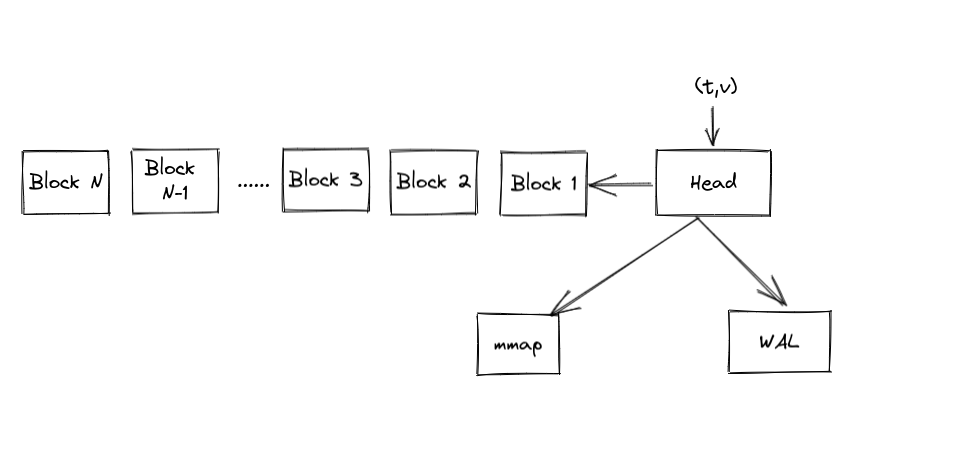

## Overview

The main goal was to support on the fly compaction of TSDB blocks without using any disk space or constant amount of the disk space. As analyzing, I came across with the following challenges:

- TSDB blocks have a special structure and the main challenge stems from already big size of a single block.
- `compactor` module is written such that it operates on the  already downloaded blocks, so nothing to be done here.
- Initially, I had proposed to have a partial upload and download to accomodate a single download and upload problem, but I identified that downloading dependency (`minio`) already employs it.

## Analysis

I moved to analyze the whole codebase, and with the help of my supervisor we identified `BucketReader` interface which is responsible for read access to an object storage bucket and all the other cloud provider support modules are implementing it. My supervisor suggested to imlement a new and scratch version of it which uses a streaming behavior. To be precise, it should bring chunks based on the read index and compact on chunk basis. Howevere, it is not a trivial thing and requires an in depth analysis of TSDB block structure and needs a planning mechanism wo bring which chunks and when to stop bringing. Since, the system is widely used in production, it should be well tested and shouldn;t result in data loss, hence increasing the complexity. So, we decided to take time to in depth analyze the above mentioned problems and come up with a strategy, 

`BucketReader` consists of `Iter`, `Get`, `GetRange`, `Exists` `IsObjNotFoundErr` and `Attributes` functions. In more detail, 
  - `Iter` calls a given function in the bucket directory passing the entries to the function.
  - `Get` provides a reader for the object
  - `GetRange` provides a range reader similar to `Get`
  - `Exists` checks whether the object exists in the bucket or not
  - `IsObjNotFoundErr` returns true if object is not found in the bucket
  - `Attributes` gives information about the specified object

TSDB blocks consists of the head block and following N blocks. Each incoming time-series data point comes to the Head block and stays there, when all of them get old enough they are persisted in the disk as a separate block. WAL and mmap coordinates this process, but only the head and 1...N blocks are interested in case of compaction, since  onlythey are resided in the object storage.



Every block has a unique identifier, called a `Universally Unique Lexicographically Sortable Identifier(ULID)`. A block has 4 constituent parts:
- `meta.json` --> the medatadata about the block
- `chunks` --> raw chunks
- `index` --> index of the block
- `tombstones` --> marker holding info whether the samples are deleted or not

Only chunks is directory, other three are regular files. 

`meta.json` has the following structure:
```js
{
    "ulid": "01EM6Q6A1YPX4G9TEB20J22B2R",
    "minTime": 1602237600000,
    "maxTime": 1602244800000,
    "stats": {
        "numSamples": 553673232,
        "numSeries": 1346066,
        "numChunks": 4440437
    },
    "compaction": {
        "level": 1,
        "sources": [
            "01EM65SHSX4VARXBBHBF0M0FDS",
            "01EM6GAJSYWSQQRDY782EA5ZPN"
        ]
    },
    "version": 1
}
```

`chunks` directory has numbered files each representing a separate chunk and has a size of `512 MiB`.

Planning phase of the compaction decides which blocks to compact. In our case, we should read the relevant block metadata and do planning based upon them. Since, metadata files are small in size reading several of them will not incur that much cost. With the new modified planning phase, we can decid upon which blocks are of interest for the current compaction stage and stream the chunks of those blocks in parallel. Reading those streams, one can compact and create new chunks in memory(it may also be mmap-ed file in disk). When the newly created chunks of the block reach some size it can be uploaded to object storage.

Unfortunately, regarding time constraints and implementation complextiy, the result of above analysis is not completely ready. I plan to incremenetally implement by learning best practices. By analyizng the `Thanos` code base I get the good grasp of best practices of `Go` programming language and learned lots of unknown features to me. I believe those will help me to implement the result of analysis.

## Acknowledgements
To sum up, GSoC was a good experience to learn, develop and be a part of larger open source community. Despite the fact that project was challenging, I learned a lot about time series databases, cloud object storage, and  `Go` programming language. I would like to especially thank `Ben Ye` for his constant support and inspiration, and all `Thanos` community. Moreover, I would like to express my gratitude to all the folks in `Google` making the `Google Summer of Code` and inspiring newbies in the open source.
